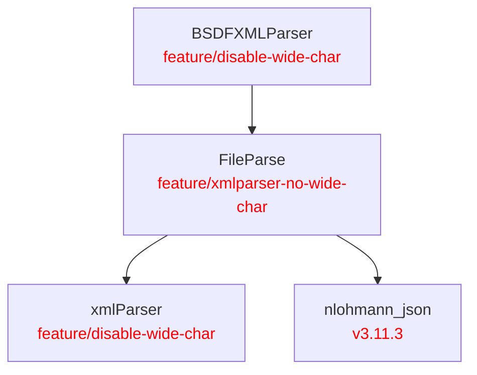

```mermaid
graph TD
    %% Package definitions
    xmlParser[xmlParser<br/><font color='red'>feature/disable-wide-char</font>]
    nlohmann_json[nlohmann_json<br/><font color='red'>v3.11.3</font>]
    FileParse[FileParse<br/><font color='red'>feature/xmlparser-no-wide-char</font>]
    BSDFXMLParser[BSDFXMLParser<br/><font color='red'>feature/disable-wide-char</font>]

    %% Package relations
    BSDFXMLParser --> FileParse
    FileParse --> xmlParser
    FileParse --> nlohmann_json
```
